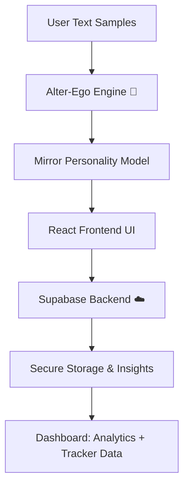

# 🕵️‍♂️ ShadowMe — Your Intelligent Digital Shadow

[](https://opensource.org/licenses/MIT)
[](https://github.com/DeathlyHalows/ShadowMe/stargazers)
[](https://github.com/DeathlyHalows/ShadowMe/network/members)
[](https://react.dev/)
[](https://supabase.com/)

> **"Create your intelligent digital shadow — one that learns, mirrors, and evolves with you."**

---

## 🏆 Hackathon Submission

This project is a submission for the **HackaThrone 2025** hackathon.  
**Pillars:** Artificial Intelligence, Web Development, Cybersecurity, Innovations   
**Team Name:** RockStar ByteSquads

**Team Members:**
- **Shyam Ganesh V** — Lead Developer & Architect  
- **Viswas M** — Frontend & AI systems
- **Shyam Sundar M** - Frontend
- **Jagadhishwar** - Frontend

---

## 🚨 The Problem

Every click, post, and message contributes to your **digital fingerprint**.  
Meanwhile, the rise of AI and web tracking has blurred the line between **authentic identity** and **algorithmic profiling**.

Users lack control over:
- How they are digitally represented and interpreted  
- How AI perceives their tone, intent, and reasoning  
- How much of their **digital self** belongs to them  

---

## 💡 The Vision — “ShadowMe”

**ShadowMe** lets you create your **intelligent digital shadow** — a version of yourself that learns your communication style, thinking patterns, and personality traits.

You can:
- **Train it** with your own text samples  
- **Chat** with it in real time  
- **Enable Mirror Mode** — where your AI shadow constructively challenges your thoughts and reasoning  

It’s both a **privacy shield** and a **self-reflective AI companion**.

---

## ⚙️ How It Works

| Feature | Description |
|----------|-------------|
| 🧠 **AI Persona Training** | Upload or type text samples — ShadowMe learns your tone, phrasing, and logic. |
| 💬 **Real-Time Chat** | Talk to your AI reflection and explore how it understands and mirrors you. |
| 🪞 **Mirror Mode** | Engage in constructive debate — ShadowMe questions and refines your viewpoints. |
| 🧩 **Fingerprint Shield** | Protects against trackers and anonymizes browser-level data points. |
| ☁️ **Cloud Intelligence** | Built on Supabase for secure and scalable data handling. |

---

## 🧰 Tech Stack

| Layer | Technologies |
|-------|---------------|
| **Frontend** | React + TypeScript + Tailwind CSS |
| **Backend** | Supabase (PostgreSQL + Auth) |
| **AI / Core Engine** | Custom “Alter-Ego Engine” built in TypeScript |
| **Build Tool** | Vite |
| **Package Manager** | Bun |
| **Styling** | Tailwind CSS |

---

## 🧠 Architecture Overview



---

## 📊 Dashboard & Analytics

The ShadowMe dashboard gives you a **visual overview** of your AI’s evolution:
- **Privacy Index** — before/after anonymization
- **Learning Progress** — how well the AI mirrors you
- **Tone & Personality Insights** from chats

Built using React + Tailwind for a modern, lightweight experience.

---

## 🧪 Installation & Setup

### Prerequisites
- [Bun](https://bun.sh/) installed  
- [Node.js](https://nodejs.org/) (optional for compatibility)  
- A [Supabase](https://supabase.com/) project for the backend  

### 1️⃣ Clone and Install
```bash
git clone https://github.com/DeathlyHalows/ShadowMe.git
cd ShadowMe
bun install
```

### 2️⃣ Configure Environment
Create a `.env` file in the project root:
```bash
VITE_SUPABASE_URL=your_supabase_url
VITE_SUPABASE_ANON_KEY=your_supabase_anon_key
```

### 3️⃣ Run the Development Server
```bash
bun dev
```

### 4️⃣ (Optional) Load as a Chrome Extension
1. Go to `chrome://extensions`  
2. Enable **Developer Mode**  
3. Click **Load Unpacked**  
4. Select the `/dist` folder after build  

---

## 🎥 Demo


> *Coming soon:* A short demo video showcasing the AI training, chat interface, and privacy dashboard.

---

## 🔮 Future Roadmap

- [ ] Personality embeddings for deeper contextual learning  
- [ ] Voice-based AI mirror conversations  
- [ ] End-to-end encrypted chat history  
- [ ] Multi-language personality adaptation  
- [ ] Chrome Web Store & Firefox Add-on releases  

---

## 🧑‍💻 Creators

| Name | Role | GitHub |
|------|------|--------|
| **Shyam Ganesh V** | Lead Developer & Product Architect | [@DeathlyHalows](https://github.com/DeathlyHalows) |
| **Viswas** | Frontend & AI systems | [@viswaswork](https://github.com/viswaswork) |
| **Shyam Sundar M** | Frontend | [@shyammohan07](https://github.com/shyammohan07) |

---

## 🪪 License

This project is licensed under the **MIT License** — see the [LICENSE](./LICENSE) file for details.

---

## 💬 Judging Criteria Highlights

| Criteria | How ShadowMe Excels |
|-----------|--------------------|
| **Innovation** | Combines AI self-replication with privacy shielding — a unique fusion of introspective and defensive AI. |
| **Technical Complexity** | Multi-layered architecture using Bun, React, TypeScript, and Supabase for real-time AI interaction. |
| **Impact** | Empowers users to regain digital autonomy and understand their own communication style through AI reflection. |
| **User Experience** | Minimalist, responsive UI built with Tailwind and Vite, focusing on performance and usability. |

---

## ⭐ Support

If you like **ShadowMe**, please give it a ⭐ on GitHub — your support helps the project grow!

---

> _"In a world full of algorithms that watch you, it’s time to build one that understands you."_  
> **ShadowMe** — your AI reflection, your privacy shield, your digital consciousness.


